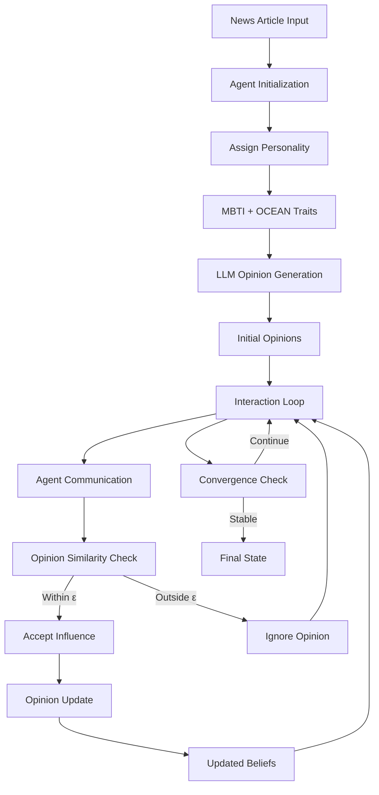
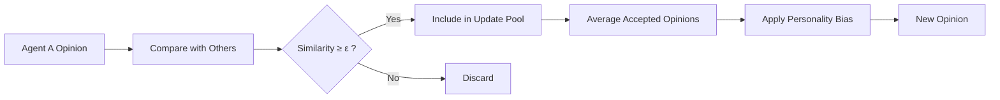
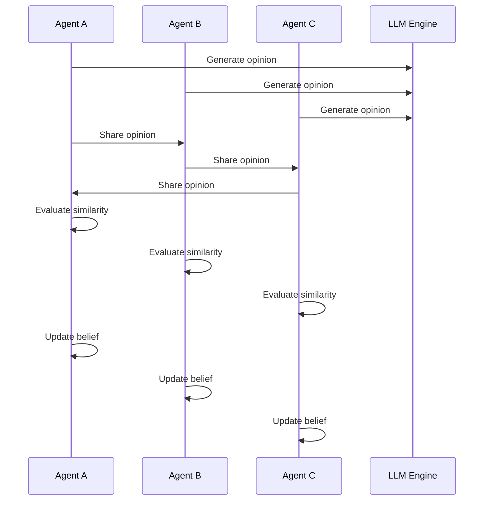

# 🧠 Opinion Dynamics Simulator

> **A multi-agent AI system where personalities shape beliefs, interactions create influence, and polarization emerges naturally.**

---

## 🌍 Overview

The **Opinion Dynamics Simulator** models how beliefs evolve inside a society of AI agents.

Each agent:

* Has a **personality (MBTI + OCEAN)**
* Reads and interprets a **shared news article**
* Interacts with other agents using **LLMs**
* Updates beliefs using a **bounded confidence model**

The result?
👉 A fully simulated digital society where **consensus, disagreement, and echo chambers emerge organically**.

---

## ⚡ Key Highlights

* 🧠 **LLM-powered reasoning agents**
* 🧬 **Personality-driven behavior (MBTI + OCEAN)**
* 🔗 **Hegselmann–Krause opinion dynamics**
* 📊 **Real-time analytics & metrics**
* 🎨 **Visualization of belief clusters**
* 🧪 **Research-ready simulation framework**

---

## 🧩 System Architecture



---

## 🧠 Opinion Update Logic



---

## 🧬 Personality Model

Each agent combines:

* **MBTI Archetype** → behavioral style
* **OCEAN Traits** → numerical influence factors

| Trait             | Role                  |
| ----------------- | --------------------- |
| Openness          | Willingness to change |
| Conscientiousness | Stability & structure |
| Extraversion      | Interaction frequency |
| Agreeableness     | Support vs opposition |
| Neuroticism       | Emotional sensitivity |

---

## 🔄 Simulation Flow



---

## 📊 Metrics & Insights

* 📈 **Polarization Index (P)**
* 🧱 **Echo Chamber Index (E)**
* 🎯 **Agent Influence Scores**
* 🧬 **MBTI-based analytics**
* ⏹️ **Convergence detection**

---

## 🎨 Visual Outputs

* Opinion evolution graphs
* Influence distribution charts
* Decision pattern breakdowns
* UMAP-based opinion clustering

---

## ⚙️ Configuration

```python
CONFIG = {
    "n_agents_per_type": 10,
    "n_turns": 20,
    "llm_model": "TinyLlama-...",
    "embedding_model": "all-MiniLM-L6-v2",
    "epsilon": 0.65,
    "batch_size": 4,
    "enable_rag_memory": True,
    "convergence_threshold": 0.95
}
```

---

## 🚀 Getting Started

### 🖥️ Local Setup

```bash
git clone <repo-url>
cd opinion-dynamics

python -m venv venv
source venv/bin/activate      # Windows: venv\Scripts\activate

pip install -r requirements.txt
python kaggle.py
```

---

### ☁️ Kaggle Setup

1. Create a new notebook
2. Paste `kaggle.py`
3. (Optional) Add Hugging Face token
4. Run 🚀

---

## 🧪 Example Behaviors

### 🏛️ Political Topics

* Strong clustering
* Persistent disagreement
* High polarization

### 🔬 Scientific Topics

* Faster convergence
* Lower conflict
* Weak clustering

### 🤖 Tech Policy

* Two stable opinion groups
* Boundary agents fluctuate

---

## 🧰 Tech Stack

* **PyTorch** → GPU acceleration
* **Transformers** → LLMs
* **Sentence Transformers** → embeddings
* **Plotly** → visualization
* **NetworkX** → interaction graphs
* **ChromaDB** → agent memory
* **UMAP** → clustering

---

## 📦 Output Structure

```bash
simulation_results.json
visualizations/
```

---

## 🔮 Future Work

* 🌐 Multi-topic simulations
* 🎯 Influencer injection
* 🔗 Real network topologies
* 📊 Causal reasoning
* 🤖 Multi-model ecosystems
* 🌍 Live news integration

---

## 💡 Key Insight

> **Polarization doesn’t require conflict—only selective trust.**

---

## 🤝 Contributing

PRs welcome!

---

## 📜 License

Hegselmann–Krause model (2002)

---

## 👨‍💻 About Me

**Manamnath Tiwari**  
AI/ML Developer  

📧 manamnathtiwari@gmail.com  
🔗 LinkedIn: https://www.linkedin.com/in/manamnath-tiwari  
💻 GitHub: https://github.com/manamnathtiwari 

---

**Made with 🧠 + ⚡ + 📊**
