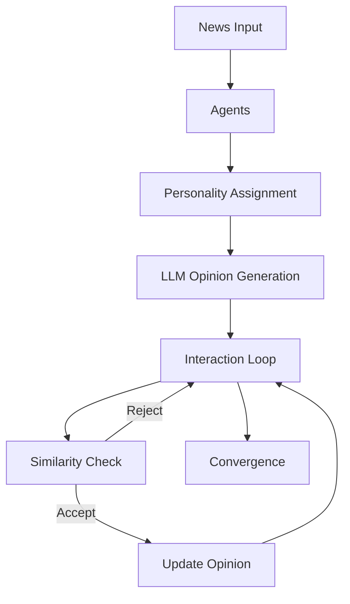

# 🧠 Opinion Dynamics Simulator

> A multi-agent AI system where personalities shape beliefs and interactions create emergent societal dynamics.

## Overview
This project simulates how opinions evolve in a society of AI agents using:
- LLM-based reasoning
- Personality traits (MBTI + OCEAN)
- Hegselmann–Krause bounded confidence model

## Features
- Personality-driven agents
- Opinion clustering & polarization
- Real-time metrics & visualization
- Research-ready simulation logs

## Architecture


## Installation
```bash
pip install -r requirements.txt
python kaggle.py
```

## Configuration
Adjust CONFIG in code for agents, turns, and models.

## Insight
Polarization emerges naturally when agents only trust similar opinions.

---

Made with 🧠 + ⚡
